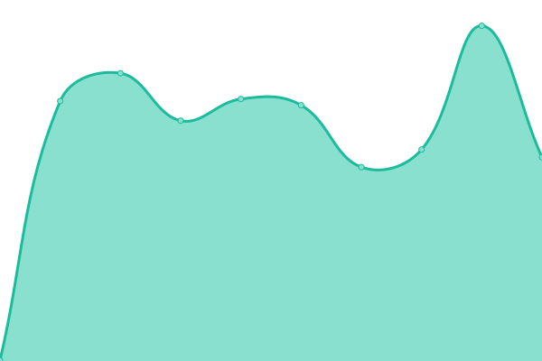

# [📈 Live Status](https://demo.upptime.js.org): <!--live status--> **🟩 All systems operational**

This repository contains the open-source uptime monitor and status page for [Gianni Stubbe](https://unitix.be), powered by [Upptime](https://github.com/upptime/upptime).

With [Upptime](https://upptime.js.org), you can get your own unlimited and free uptime monitor and status page, powered entirely by a GitHub repository. We use [Issues](https://github.com/33Fraise33/upptime/issues) as incident reports, [Actions](https://github.com/33Fraise33/upptime/actions) as uptime monitors, and [Pages](https://demo.upptime.js.org) for the status page.

<!--start: status pages-->
<!-- This summary is generated by Upptime (https://github.com/upptime/upptime) -->
<!-- Do not edit this manually, your changes will be overwritten -->
<!-- prettier-ignore -->
| URL | Status | History | Response Time | Uptime |
| --- | ------ | ------- | ------------- | ------ |
|  [Frai.se](https://frai.se) | 🟩 Up | [frai-se.yml](https://github.com/33Fraise33/upptime/commits/HEAD/history/frai-se.yml) | 

 553ms
     
 | 

<a href="https://status.frai.se/history/frai-se">100.00%</a>
    

|  [Unitix](https://unitix.be) | 🟩 Up | [unitix.yml](https://github.com/33Fraise33/upptime/commits/HEAD/history/unitix.yml) | 

 953ms
     
 | 

<a href="https://status.frai.se/history/unitix">100.00%</a>
    

|  [Home Assistant](https://ha.frai.se) | 🟩 Up | [home-assistant.yml](https://github.com/33Fraise33/upptime/commits/HEAD/history/home-assistant.yml) | 

 577ms
     
 | 

<a href="https://status.frai.se/history/home-assistant">100.00%</a>
    

|  [Synapse Matrix](https://matrix.frai.se/health) | 🟩 Up | [synapse-matrix.yml](https://github.com/33Fraise33/upptime/commits/HEAD/history/synapse-matrix.yml) | 

 524ms
     
 | 

<a href="https://status.frai.se/history/synapse-matrix">100.00%</a>
    

<!--end: status pages-->

[**Visit our status website →**](https://demo.upptime.js.org)

## 📄 License

- Powered by: [Upptime](https://github.com/upptime/upptime)
- Code: [MIT](./LICENSE) © [Gianni Stubbe](https://unitix.be)
- Data in the `./history` directory: [Open Database License](https://opendatacommons.org/licenses/odbl/1-0/)
